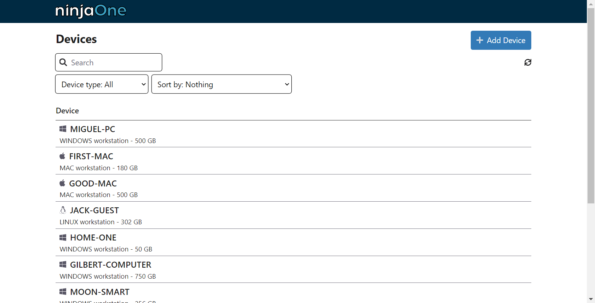
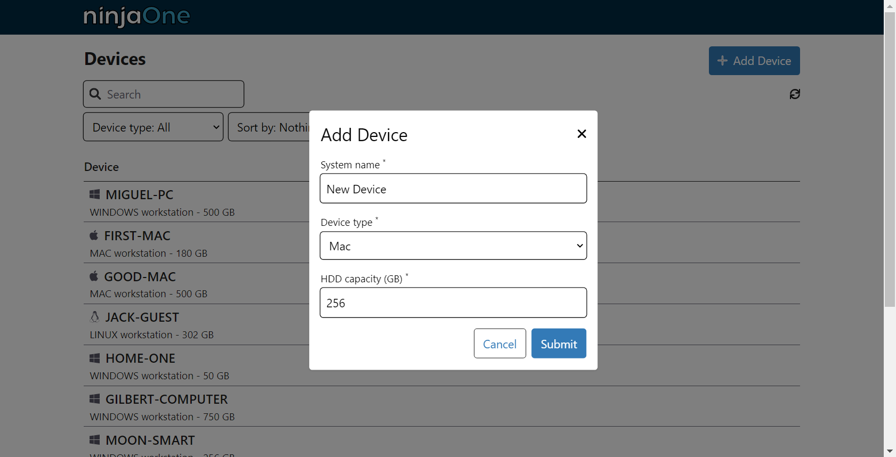
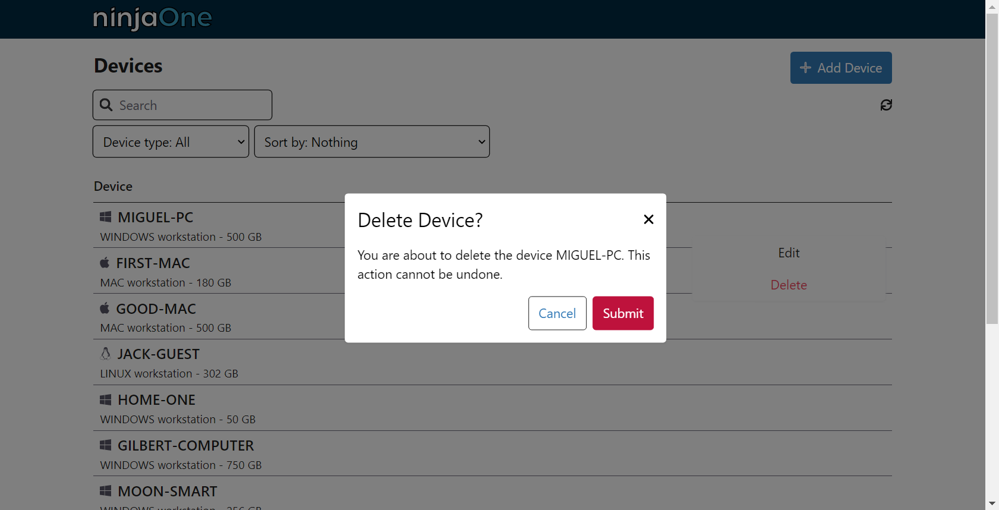
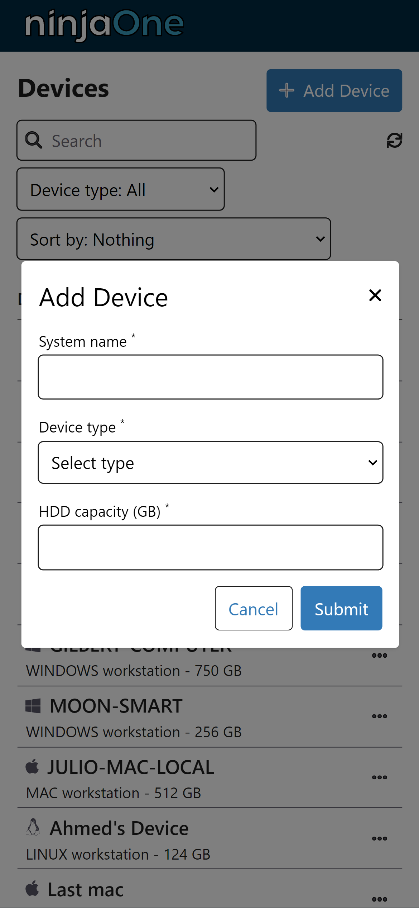

# Devices Mangament

This project is a simple devices management system. It is a web application that allows you to manage devices.

## api CRUD

It is acutally a simple excercise of a CRUD api. It is a simple api that allows you to create, read, update and delete devices.

## Frontend

- React.js [v18.2.0](https://reactjs.org/)
- Typescript [v4.9.5](https://www.typescriptlang.org/)
- Axios v1.3.1

was created with `create-react-app` and `typescript` template.

To get started, run in your terminal:

```bash
npm start
```

## Backend

Backend is made by [ninjaOne](https://github.com/NinjaRMM/devicesTask_serverApp)

To get started, run in your terminal:

```bash
git clone https://github.com/NinjaRMM/devicesTask_serverApp.git
npm install
npm start
```

## Overview





